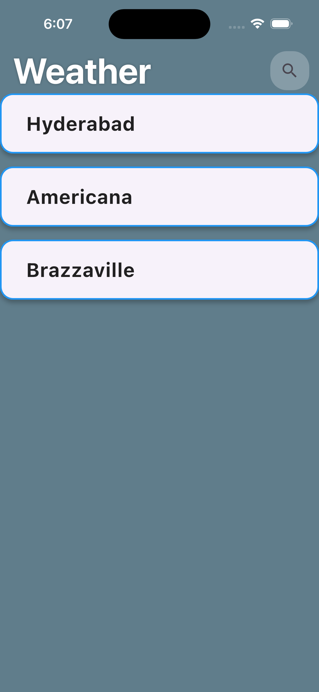
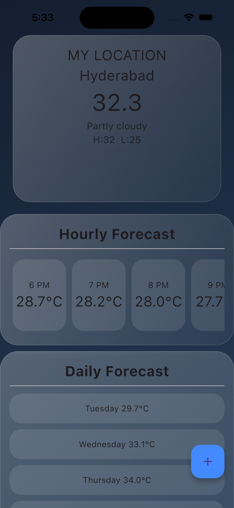
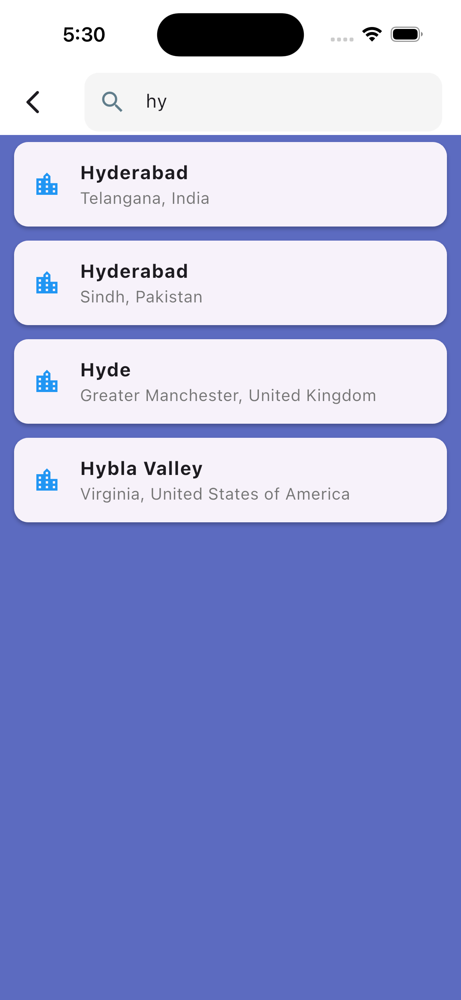

<<<<<<< HEAD
# weather_y18

A new Flutter project.

## Getting Started

This project is a starting point for a Flutter application.

A few resources to get you started if this is your first Flutter project:

- [Learn Flutter](https://docs.flutter.dev/get-started/learn-flutter)
- [Write your first Flutter app](https://docs.flutter.dev/get-started/codelab)
- [Flutter learning resources](https://docs.flutter.dev/reference/learning-resources)

For help getting started with Flutter development, view the
[online documentation](https://docs.flutter.dev/), which offers tutorials,
samples, guidance on mobile development, and a full API reference.
=======
# weather-app-flutter
A modern weather application built with Flutter that provides real-time weather information, forecasts, city search, and saved locations using WeatherAPI.
>>>>>>> 1a8743720eca716f9786ac6b5749a236cd156495
> 
> ## Screenshots

### Home Screen

### Weather Details

### Search Bar

